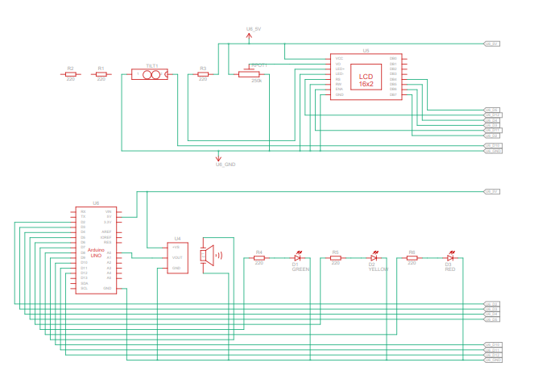
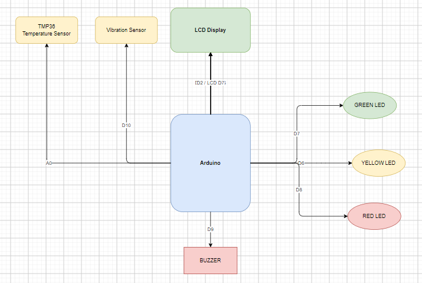
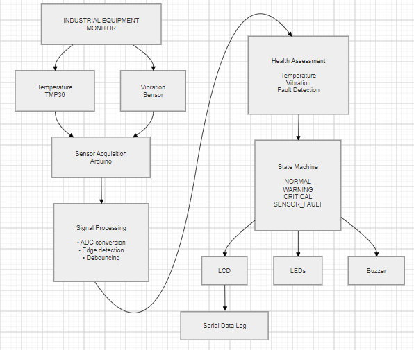
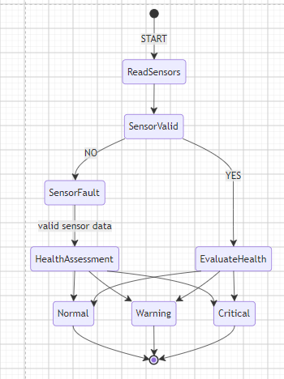

# Industrial Equipment Health Monitoring System

## By: Ismael Mfumu

**Prototype Embedded Systems Engineering Project**

---

## 🔧 Interactive Tinkercad Prototype

**Explore and run the project directly in Tinkercad:**

[**Open the Industrial Equipment Health Monitoring System in Tinkercad**](https://www.tinkercad.com/things/dOs9MAnyXfY-industrial-equipment-health-monitor?sharecode=IrBdWQUtzvsPOROV4wtcdnA7sSo2sY5sxFlFZma85As)

The Tinkercad simulation provides an interactive representation of the embedded monitoring system, allowing the hardware configuration, sensor inputs, indicators, LCD interface, and Arduino firmware to be explored and simulated.

The simulation can be used to:

* Review the prototype hardware configuration
* Inspect sensor and component connections
* Run the embedded Arduino firmware
* Simulate equipment operating conditions
* Observe equipment health-state indications
* Validate basic hardware/software interactions
* Reproduce the prototype in a controlled simulation environment

> **Note:** The Tinkercad implementation is a prototype and engineering simulation. It is intended to demonstrate embedded-system design concepts and does not represent a production industrial monitoring system.

---

# Overview

The **Industrial Equipment Health Monitoring System (IEHMS)** is an embedded condition-monitoring prototype designed to demonstrate how a microcontroller-based system can continuously monitor the condition of industrial equipment and identify potentially abnormal operating conditions.

The system uses an **Arduino Uno R3** as the embedded controller and acquires equipment-condition inputs through a **TMP36 temperature sensor** and a **tilt sensor**.

The embedded firmware processes these inputs and determines the current equipment health condition. The system then provides operator feedback through visual, audible, and display-based outputs.

### System Health Indications

| Indicator     | System Condition          |
| ------------- | ------------------------- |
| 🟢 Green LED  | Normal                    |
| 🟡 Yellow LED | Warning                   |
| 🔴 Red LED    | Critical                  |
| 📟 16 × 2 LCD | System/measurement status |
| 🔊 Piezo      | Audible alert             |

The project is designed as a **prototype embedded systems engineering project** and demonstrates the relationship between hardware, firmware, system architecture, requirements, state-based behavior, and verification.

---

# Engineering Problem

Industrial equipment can develop abnormal operating conditions before complete failure. Changes in parameters such as temperature or physical orientation can provide an indication that equipment may be operating outside its expected condition.

A condition-monitoring system can continuously observe these parameters and provide an early indication of abnormal behavior, allowing an operator or maintenance team to investigate the equipment before a more serious failure occurs.

This project explores the design of a small embedded monitoring system for a **simulated industrial asset**.

The objective is to demonstrate the engineering principles involved in:

* Sensor-based monitoring
* Embedded data acquisition
* Condition assessment
* Fault detection
* Operator notification
* State-based system behavior
* Hardware/software integration
* Verification and testing

---

# System Concept

The monitoring system follows a basic:

**Sense → Process → Evaluate → Notify**

architecture.

```text
                 ┌─────────────────────┐
                 │   Industrial Asset  │
                 │     Simulation      │
                 └──────────┬──────────┘
                            │
                    Sensor Measurements
                            │
              ┌─────────────┴─────────────┐
              │                           │
              ▼                           ▼
       TMP36 Temperature             Tilt Sensor
           Sensor                        │
              │                           │
              └─────────────┬─────────────┘
                            │
                            ▼
                    ┌──────────────┐
                    │ Arduino Uno  │
                    │     R3       │
                    └──────┬───────┘
                           │
                  Condition Evaluation
                           │
              ┌────────────┴────────────┐
              │                         │
              ▼                         ▼
       Equipment Health           Alert / Fault
           Status                    Logic
              │                         │
       ┌──────┼──────┐                  │
       ▼      ▼      ▼                  ▼
     Green  Yellow   Red              Piezo
      LED     LED     LED             Buzzer
              │
              ▼
           16 × 2 LCD
```

The Arduino serves as the central embedded controller, receiving sensor information, evaluating equipment conditions, and controlling the operator notification interfaces.

---

# System Schematic

The system schematic documents the electrical and hardware-level implementation of the prototype.

The system is built around an **Arduino Uno R3**, which interfaces with the temperature sensor, tilt sensor, status LEDs, LCD, potentiometer, and piezoelectric buzzer.

### Schematic



The schematic provides the electrical representation of the major components and their connections.

---

## Component List

| Reference | Quantity | Component                |
| --------- | -------: | ------------------------ |
| U4        |        1 | TMP36 Temperature Sensor |
| D1        |        1 | Green LED                |
| D2        |        1 | Yellow LED               |
| D3        |        1 | Red LED                  |
| U5        |        1 | 16 × 2 LCD               |
| Rpot1     |        1 | 250 kΩ Potentiometer     |
| R1–R6     |        6 | 220 Ω Resistors          |
| PIEZO1    |        1 | Piezo Buzzer             |
| TILT1     |        1 | Tilt Sensor              |
| —         |        2 | Small Breadboards        |
| U6        |        1 | Arduino Uno R3           |

---

# Hardware Architecture

## Arduino Uno R3

The **Arduino Uno R3 (U6)** serves as the central controller for the prototype.

It is responsible for:

* Reading sensor inputs
* Processing measurements
* Evaluating equipment condition
* Controlling status indicators
* Updating the LCD
* Activating the piezo alert

---

## TMP36 Temperature Sensor

The **TMP36 (U4)** provides an analog temperature signal to the Arduino.

The temperature measurement is used as one of the primary inputs for determining equipment condition.

```text
Temperature
     ↓
   TMP36
     ↓
Analog Signal
     ↓
Arduino ADC
     ↓
Temperature Calculation
     ↓
Condition Evaluation
```

---

## Tilt Sensor

The **tilt sensor (TILT1)** provides a digital indication of a change in physical orientation.

For this prototype, the tilt sensor is used to simulate an abnormal physical condition affecting the monitored equipment.

```text
Equipment Movement
       ↓
   Tilt Sensor
       ↓
 Digital Input
       ↓
    Arduino
       ↓
Condition Evaluation
```

---

## Equipment Health Indicators

Three LEDs provide a visual indication of the current equipment condition.

| LED    | Condition |
| ------ | --------- |
| Green  | Normal    |
| Yellow | Warning   |
| Red    | Critical  |

The LEDs use **220 Ω current-limiting resistors**.

---

## LCD Operator Interface

The **16 × 2 LCD (U5)** provides an operator-facing display for system information.

Depending on the operating condition, the LCD can communicate information such as:

* Temperature
* Equipment health state
* Warning conditions
* Critical conditions
* Sensor status

The **250 kΩ potentiometer (Rpot1)** is used for LCD contrast adjustment.

---

## Audible Notification

The **piezo buzzer (PIEZO1)** provides an audible alert when the system detects an abnormal or critical condition.

This allows the system to provide operator notification without relying exclusively on visual indicators.

---

# Wiring Diagram

The wiring diagram provides the physical connection view of the prototype.



The diagram supports:

* Hardware assembly
* Circuit troubleshooting
* Component identification
* Hardware/software interface verification
* Reproduction of the prototype

The wiring diagram complements the system schematic by providing a more practical representation of how the components are physically connected.

---

# System Architecture

The system architecture diagram provides the high-level functional representation of the monitoring system.



The architecture illustrates the relationship between:

```text
Sensors
   ↓
Data Acquisition
   ↓
Embedded Controller
   ↓
Condition Assessment
   ↓
Health State
   ↓
Operator Notification
```

This provides the system-level view of the prototype before considering the detailed hardware wiring or firmware implementation.

---

# State Machine

The state machine defines the behavioral states of the equipment monitoring system.



The system evaluates incoming sensor information and transitions between defined equipment health states based on the monitored conditions.

The state-based approach provides a structured method for implementing predictable system behavior.

The state model is further documented in the project requirements and implemented within the embedded firmware.

---

# Embedded Software

## `src/equipment_monitor.ino`

The `equipment_monitor.ino` file contains the embedded firmware for the system.

The firmware implements the operational behavior of the prototype, including:

* Sensor acquisition
* Temperature processing
* Tilt-condition detection
* Equipment health evaluation
* State transitions
* LED control
* LCD output
* Audible notification
* Monitoring logic

The firmware represents the **software implementation layer** of the system.

---

# Engineering Requirements

## `docs/requirements.md`

The requirements document defines what the monitoring system is expected to do.

The requirements establish the functional expectations for areas such as:

* Sensor monitoring
* Temperature measurement
* Equipment health assessment
* Warning conditions
* Critical conditions
* Fault detection
* Operator notification
* System behavior

The requirements provide the foundation for implementation and verification.

---

# Requirements Traceability

## `docs/requirements_traceability.md`

The requirements traceability document connects the defined requirements to their implementation and verification activities.

The relationship can be represented as:

```text
Requirement
     ↓
System Function
     ↓
Implementation
     ↓
Verification Test
     ↓
Test Result
```

This demonstrates how individual system requirements are carried through the engineering development and verification process.

---

# Verification & Testing

## `docs/test_plan.md`

The test plan defines the approach used to verify the monitoring system.

Testing covers conditions such as:

* Normal temperature
* Elevated temperature
* Critical temperature
* Tilt/abnormal physical condition
* Sensor faults
* Health-state transitions
* LED operation
* LCD operation
* Audible alerts

The test plan establishes the expected verification activities before evaluating the prototype.

---

## `docs/test_results.md`

The test results document records the results obtained from executing the defined tests.

The results provide evidence of whether the prototype behaves according to the defined requirements under the tested conditions.

Together, the test plan and test results provide a basic **verification and validation workflow**.

---

# Project Photos

The `photos/` directory contains photographs of the physical prototype and/or project development.

These photos provide visual evidence of:

* Hardware assembly
* Breadboard implementation
* Component integration
* Prototype development
* Physical system testing

The photos complement the Tinkercad simulation, schematic, and wiring documentation by showing the physical implementation of the project.

---

# Repository Structure

```text
Industrial Equipment Health Monitoring System
│
├── README.md
│
├── photos/
│
├── src/
│   └── equipment_monitor.ino
│
└── docs/
    ├── requirements.md
    ├── requirements_traceability.md
    ├── state_machine.png
    ├── system_architecture.png
    ├── system_schematic.png
    ├── test_plan.md
    ├── test_results.md
    └── wiring_diagram.png
```

Each directory serves a specific engineering purpose.

| Directory/File                 | Purpose                                        |
| ------------------------------ | ---------------------------------------------- |
| `README.md`                    | Project overview and engineering documentation |
| `src/`                         | Embedded firmware implementation               |
| `docs/`                        | Engineering design and verification artifacts  |
| `photos/`                      | Physical prototype documentation               |
| `requirements.md`              | System requirements                            |
| `requirements_traceability.md` | Requirement-to-verification traceability       |
| `system_architecture.png`      | High-level system architecture                 |
| `system_schematic.png`         | Electrical/system schematic                    |
| `wiring_diagram.png`           | Physical wiring configuration                  |
| `state_machine.png`            | System behavioral model                        |
| `test_plan.md`                 | Verification strategy                          |
| `test_results.md`              | Verification evidence                          |

---

# Engineering Development Workflow

The project follows an engineering-oriented development workflow:

```text
Engineering Problem
        ↓
System Requirements
        ↓
System Architecture
        ↓
System Schematic
        ↓
Hardware / Wiring
        ↓
State-Machine Design
        ↓
Embedded Firmware
        ↓
Tinkercad Simulation
        ↓
Physical Prototype
        ↓
Verification Testing
        ↓
Test Results
        ↓
Requirements Traceability
```

This approach demonstrates that the project was developed as more than an Arduino programming exercise.

The hardware, software, system behavior, requirements, simulation, physical prototype, and verification activities are treated as interconnected engineering artifacts.

---

# Engineering Skills Demonstrated

## Embedded Systems

* Arduino / microcontroller programming
* C/C++ firmware development
* Analog sensor interfacing
* Digital sensor interfacing
* ADC-based measurement
* Hardware/software integration
* Real-time monitoring
* Operator interfaces

## Systems Engineering

* Requirements definition
* System architecture
* Functional decomposition
* State-machine modeling
* Requirements traceability
* Verification planning
* System-level testing

## Hardware Engineering

* Sensor integration
* Electrical component integration
* Current-limiting resistor selection
* LCD interfacing
* Breadboard prototyping
* Hardware troubleshooting
* Hardware/software interfaces

## Verification & Validation

* Requirement-based testing
* Functional verification
* Test planning
* Test-result documentation
* Fault-condition testing
* Prototype validation

---

# Prototype Scope and Limitations

This project is an **educational embedded systems and systems engineering prototype** representing a simplified industrial equipment monitoring application.

The monitored equipment is simulated using sensor inputs rather than connected to actual industrial machinery.

A production implementation would require additional considerations including:

* Industrial-grade sensors
* Signal conditioning
* Sensor calibration
* Electrical protection
* Environmental qualification
* Redundant sensing
* Industrial communications
* Cybersecurity
* Data historian integration
* Alarm management
* Predictive-maintenance algorithms
* Applicable industrial standards

Therefore, this prototype should be viewed as a demonstration of the **engineering design process and embedded monitoring concepts**, rather than a production-ready industrial safety system.

---

# Future Improvements

Potential future development includes:

* Vibration sensors and vibration analysis
* RMS vibration calculations
* Moving-average filtering
* Sensor calibration routines
* SD-card data logging
* Historical trend analysis
* Web-based monitoring dashboard
* Wi-Fi/Ethernet connectivity
* MQTT telemetry
* Remote monitoring
* Event and alarm logging
* Predictive-maintenance algorithms
* Anomaly detection
* Watchdog and recovery mechanisms
* Industrial communication protocols

---

# Project Summary

The **Industrial Equipment Health Monitoring System** demonstrates how an embedded monitoring solution can be developed using an engineering-oriented approach.

The project connects:

**Requirements → Architecture → Schematic → Hardware → Software → System Behavior → Simulation → Physical Prototype → Verification → Traceability**

The combination of the **interactive Tinkercad prototype, Arduino firmware, system architecture, system schematic, wiring diagram, state machine, requirements, physical prototype photos, and verification artifacts** provides a complete view of the engineering development process.

---

**Project:** Industrial Equipment Health Monitoring System
**Author:** Ismael Mfumu
**Type:** Embedded Systems / Systems Engineering Prototype
**Platform:** Arduino Uno R3
**Simulation:** Tinkercad Circuits
